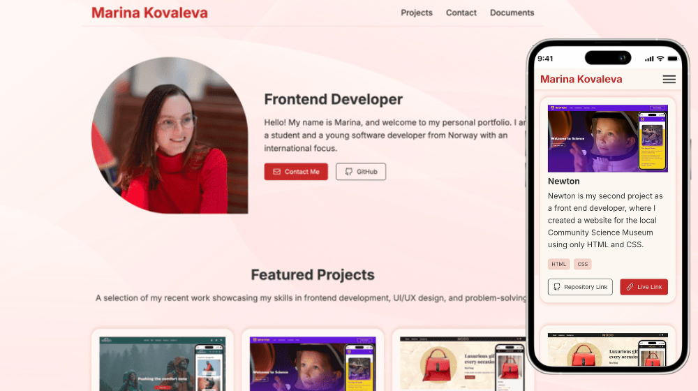

# Project Title
👋 Portfolio - Marina Kovaleva

## Screenshot


Welcome to my Portfolio! This project showcases the work I’ve done as a front-end development student in my first year. Here, you will find three of the projects I’ve built so far, demonstrating my growing skills in HTML, CSS, and JavaScript.

## Description
- Showcase of My Work: A collection of three different projects I've built as part of my learning journey.
- Responsive Design: My portfolio is designed to be fully responsive, meaning it looks great on both mobile and desktop devices.
- Project Details: For each project, you can explore the details, the technologies used, and links to live demos or GitHub repositories.
- Clean and Modern Layout: A minimalistic and clean design to highlight the projects and make navigation intuitive.

Projects Featured in My Portfolio:
1. Rainy Days - Online Shopping Website
Description: My first project, developed primarily on HTML and CSS. I created a website where customers can shop rain jackets.

2. Newton - Community Science Museum
Description: My second project as a front end developer, where I created a website for the local Community Science Museum using only HTML and CSS.

3. Modo - Online Shopping Website
Description: My year-end project exam: building a clean, modern e-commerce website using what I have learned in HTML, CSS, and JavaScript so far.

---

## Built With
List the main tools and technologies used in this project:

- HTML
- CSS
- JS
---

## Installation

Follow these steps to get a copy of the project running locally:

1. Clone the repository:
   ```bash
   git clone https://github.com/M-Kovaleva/marina-kovaleva-portfolio
   ```

2. Open the repository:
   ```bash
   cd your-repo-name
   ```
3. Run Live Server

Link to deployed web application: https://m-kovaleva.github.io/marina-kovaleva-portfolio/

## License

MIT License

## Contact
Marina Kovaleva - owlet.savvina@gmail.com
Project Link: [https://github.com/M-Kovaleva/marina-kovaleva-portfolio](https://github.com/M-Kovaleva/marina-kovaleva-portfolio)

